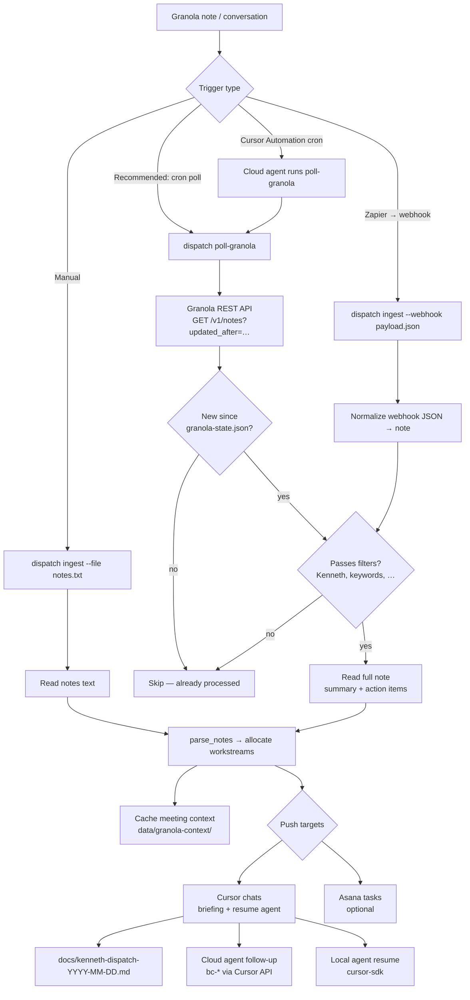

# Granola → Dispatch automation

This document describes how new Granola meeting notes trigger the work-dispatch pipeline.

## Flowchart



## What triggers dispatch?

| Method | Granola support | How it works |
|--------|-----------------|--------------|
| **CLI poll** (`dispatch poll-granola`) | ✅ Granola REST API | Polls `public-api.granola.ai` for notes updated since last run. **Recommended.** |
| **Cron / launchd** | ✅ Same as poll | Run `dispatch poll-granola` every N minutes. |
| **Cursor Automation (cron)** | ✅ Via shell in repo | Scheduled cloud agent runs `dispatch poll-granola` in this repo. |
| **Zapier webhook** | ✅ Zapier triggers only | Granola has **no native webhooks**. Use Zapier triggers *Note Added to Folder* or *Note Shared to Zapier*, POST to your endpoint, then `dispatch ingest --webhook`. |
| **Granola MCP push** | ❌ Not available | MCP is read-only OAuth; no change events or webhooks. |

State is tracked in `data/granola-state.json` (`last_poll_at`, `processed_note_ids`).

## One-time setup

### 1. Granola API key (for polling)

1. Granola desktop app → **Settings → Connectors → API keys**
2. Create a key with scopes that include Kenneth's meetings (personal and/or public notes)
3. Add to `.env`:

```bash
GRANOLA_API_KEY=grn_...
```

Requires a Granola **Business or Enterprise** plan.

### 2. Cursor API (for cloud agent follow-ups)

```bash
CURSOR_API_KEY=cursor_...
```

Link workstream chats:

```bash
dispatch list-chats
dispatch link-chat hk-vetting bc-...
dispatch link-chat pro-activation bc-...
```

### 3. Asana (optional)

```bash
ASANA_ACCESS_TOKEN=...
ASANA_WORKSPACE_GID=...
```

Set `project_name` per workstream in `dispatch/registry.yaml`, then enable:

```yaml
automation:
  on_new_note:
    push_asana: true
```

### 4. Registry automation block

`dispatch/registry.yaml` controls filters and defaults:

```yaml
automation:
  enabled: true
  trigger: poll
  poll_interval_minutes: 15
  filters:
    require_manager: true   # Kenneth in title, summary, or attendees
    min_action_items: 0
  on_new_note:
    cache_context: true
    push_cursor: true
    push_asana: false
    dry_run: false
```

## Running the automation

### Poll once (manual or cron)

```bash
cd ~/Projects/work-dispatch
source .venv/bin/activate
dispatch poll-granola              # live run
dispatch poll-granola --dry-run    # detect + route only
dispatch poll-granola --asana      # also create Asana tasks
```

### macOS launchd example (every 15 minutes)

```xml
<!-- ~/Library/LaunchAgents/com.work-dispatch.poll-granola.plist -->
<?xml version="1.0" encoding="UTF-8"?>
<!DOCTYPE plist PUBLIC "-//Apple//DTD PLIST 1.0//EN" "http://www.apple.com/DTDs/PropertyList-1.0.dtd">
<plist version="1.0">
<dict>
  <key>Label</key><string>com.work-dispatch.poll-granola</string>
  <key>ProgramArguments</key>
  <array>
    <string>/Users/you/Projects/work-dispatch/.venv/bin/dispatch</string>
    <string>poll-granola</string>
  </array>
  <key>WorkingDirectory</key><string>/Users/you/Projects/work-dispatch</string>
  <key>StartInterval</key><integer>900</integer>
  <key>StandardOutPath</key><string>/tmp/work-dispatch-poll.log</string>
  <key>StandardErrorPath</key><string>/tmp/work-dispatch-poll.err</string>
</dict>
</plist>
```

Load: `launchctl load ~/Library/LaunchAgents/com.work-dispatch.poll-granola.plist`

### Cursor Automation (cron)

Create a **scheduled** Cursor Automation in the Agents window:

| Field | Value |
|-------|-------|
| Trigger | Every 15 minutes (or match `poll_interval_minutes`) |
| Repo | `work-dispatch` |
| Instructions | Run `dispatch poll-granola` from the project venv. Report how many notes were ingested and which workstreams were updated. If `CURSOR_API_KEY` or `GRANOLA_API_KEY` is missing, say so clearly. |

The automation agent needs env vars available in its cloud runtime (configure in Cursor dashboard) or use a wrapper script that sources `.env`.

### Zapier → webhook → ingest

1. Zapier trigger: **Granola — Note Added to Folder** (or *Note Shared to Zapier*)
2. Action: **Webhooks by Zapier — POST** to your machine or a small relay
3. Save payload and run:

```bash
dispatch ingest --webhook /tmp/granola-zapier.json
```

Or pipe JSON on stdin with a small wrapper script.

## Pipeline stages

1. **Read** — Fetch note from Granola API (or webhook JSON / pasted notes)
2. **Parse** — Extract action items from `summary_markdown`; fall back to full summary
3. **Allocate** — `parse_notes()` keyword-routes items to workstreams (`hk-vetting`, `pro-activation`, `general`)
4. **Push**
   - **Context** — Meeting summary saved to `data/granola-context/<workstream>.md`
   - **Cursor** — Briefing written to `docs/kenneth-dispatch-*.md`; follow-up sent to linked `bc-*` agents
   - **Asana** — Task created when `push_asana` and project names are configured

## Troubleshooting

| Symptom | Fix |
|---------|-----|
| `automation.enabled is false` | Set `automation.enabled: true` in registry |
| `GRANOLA_API_KEY is required` | Add key to `.env` (Business/Enterprise plan) |
| Notes skipped: `manager not in meeting` | Set `filters.require_manager: false` or broaden filters |
| Notes skipped: `already processed` | Delete id from `data/granola-state.json` to re-ingest |
| Cursor: `manual` / `new_chat` | Run `dispatch link-chat <workstream> <agent-id>` |
| Empty action items | Note summary may lack checkboxes; pipeline uses full summary as notes |

## MCP vs API

- **Granola MCP** (`mcp.granola.ai`) — OAuth, used in Cursor chats for ad-hoc queries; **no push/poll from CLI**
- **Granola REST API** (`public-api.granola.ai`) — API key, used by `poll-granola`; **supports polling**

Both are read-only. Neither exposes webhooks today.
