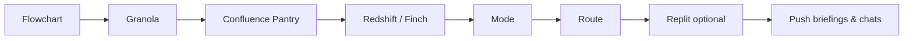

# Integration pipeline

Every dispatch run enriches priorities from three input types before pushing to project chats:

1. **Your notes** — what you captured from Kenneth (`--source manual`)
2. **Team calls** — Granola (`--source calls` or poll/ingest)
3. **1:1s** — Granola (`--source one_on_one` or poll/ingest)

## Flowchart (always first)

```bash
dispatch flowchart --notes "Your notes here"
```

Writes `data/runs/<timestamp>-run-flowchart.md` and prints mermaid + explanation.

`dispatch run` does this automatically unless you pass `--quiet`.

## Stages



| Stage | MCP | What it adds |
|-------|-----|----------------|
| 0 Flowchart | CLI | Pipeline visualization before any work |
| 1 Granola | granola | Meeting decisions, Kenneth priorities |
| 2 Confluence | atlassian | Pantry (`PANTRY` space) specs & runbooks |
| 3 Redshift | finch-redshift | Live funnel / activation metrics |
| 4 Mode | mode-analytics | Curated reports & SQL |
| 5 Route | CLI | Keyword match → workstreams |
| 6 Replit | replit | Optional prototype sandboxes |
| 7 Push | Cursor API | Briefings + linked chats |

## MCP setup

Project config: `.cursor/mcp.json` + `.cursor/settings.json`

| Server | Config |
|--------|--------|
| Granola | `url: https://mcp.granola.ai/mcp` — OAuth in Settings |
| finch-redshift | `url: https://finch.instawork.com/mcp/redshift/` |
| Atlassian | Plugin enabled — OAuth for Confluence |
| mode-analytics | `npx @cci-labs/mode-mcp` — set `MODE_WORKSPACE`, `MODE_API_TOKEN`, `MODE_API_SECRET` in mcp.json |
| Replit | `url: https://replit-mcp.com/server/mcp` — OAuth |

Reload Cursor (`Developer: Reload Window`) after editing MCP config.

## Commands

```bash
dispatch integration-queries --notes "..."
dispatch save-integration-context hk-vetting confluence /tmp/pantry.md
dispatch save-integration-context hk-vetting redshift /tmp/metrics.md
dispatch run --notes "..." --granola --integrations
```

Cached integration context: `data/integration-context/<workstream>/<source>.md`
